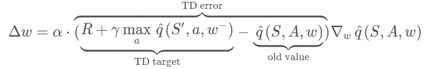
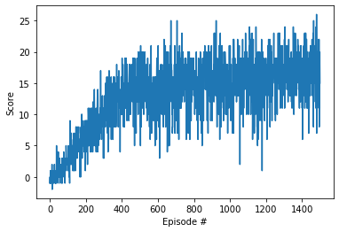

# Report of the Project 1 - Udacity DRL: Navigation

The following is the report corresponding to the current project 1 for the Udacity DRL Nanodegree. I am going to divide it into three main parts:
- Learning Algorithm
- Plot of Rewards
- Ideas for Future Work
## 1. Learning Algorithm

The algorithm used in this project to solve the [environment](https://s3-us-west-1.amazonaws.com/udacity-drlnd/P1/Banana/Banana_Linux.zip) is __Deep Q-Learning__. This algorithm was first introduced in the [paper](https://storage.googleapis.com/deepmind-media/dqn/DQNNaturePaper.pdf) proposed by [DeepMind](https://deepmind.com/).

### Deep Q-Learning (DQL)

When we use Reinforcement Learning to solve a problem, what we are looking for is to get a _polici_ that indicates for each state what action to take to maximize the return.

One of the mechanisms that we have to achieve this goal is to use __Q-Learning__, which is an algorithm that belongs to the TD-control algorithms. It looks for modeling the __action-value function__ for our environment, the theory tells us that once we have this function we can get the optimal policy for our agent.

Q-Learning stores the states of the environment in a __Q-table__ and it works very well on discretized spaces, the problem comes when we are trying to solve problems that rely on continuous spaces, the Q-table could raise infinitely and soon or late it will become incomputable.

Here is were __Deep Q-Learning__ comes to play. The main idea behind DQL is to use a neural network as a function approximator, the function to approximate is precisely the __action-value function__. Following this approach we can solve more complex environments.

We feed the neural network with the representation of the state,  and the output of the network is a layer with the same number of neurons as the possible actions for the agent.  Each neuron on the output layer tells us the _value_ of that specific action. The hidden layers, as well as the activation functions, need to be designed, proved and changed until we have a model with good performance.

For example, we can propose a convolutional neural network. The input of the model can be an image of a videogame. Imagine that our agent can move up, down, left and right, we have four possible actions, so we have an output for our model of four neurons.

When we have the model trained we just need to feed with the current state of the agent and the argmax value in the output layer tells the action what action to take to get the max return.

### Model Architecture

* The model used to solve the environment is a __MLP__. The architecture of the model is as follows:
    - __Input Layer__
        -   37 neurons
    - __Hidden Layers__
        -   128 neurons with __relu__ as the activation function
        -   32 neurons with __relu__ as the activation function
    - __Output Layer__
        -   4 neurons with __relu__ as the activation function
    -   __Optimzer__
        -   Adam
    -   __Learning Rate__
        -   0.0005

### Agent Hyperparameters
We use the following equation to update the weights of the model on each step:

We need to set the __discount factor &gamma;__ that is the one that defines how much is taking into account the future rewards, so that if it is equal to 0 the agent only considers the immediate reward.

* The value of the __discount factor &gamma;__ for this project was set to __0.99__

The last thing to talk about is the __experience replay__ which is nothing more than a collection of experiences __(S, A, R, S')__. These tuples are gradually added to the buffer of the agent.

* The value of the __experience replay__ for this project was set to __64__

Some of the advantages of the use of experience replay are:
 - Breaking harmful correlations. 
 - To learn more from individual tuples multiple times.
 - Recall of rare occurrences, and 
 - In general, make better use of the experience.

## 2. Plot of Rewards

The agent run 1500 episodes for training, however, it was able to solve the environment after __600 episodes__ accomplishing the goal of, at least, 100 consecutive episodes with a reward of +13. The maximal average score reached for the agent was __+17__ during the episode 1400. Below you can see a capture of the graph got in training. 

## 3. Ideas for Future Work

Even when the agent solved the environment many possible changes can be done to improve the performance of the agent.

### Try other neural network architectures
The simplest improvement that we can try is varying the number of hidden layers of the model and so the number of neurons os them. Another thing to do is to try with different activations functions just like any other neural network.

### Play around with the hyperparameter
We may achieve better performance with a different value for the learning rate for example or changing the value of the discount factor.

### Try other DQL improvements
There are some DQL improvements described in different papers that have shown remarkable performance, we should try some of them or even a combination of each of them in something known as [Rainbow DQL](https://arxiv.org/abs/1710.02298)

- __Double DQN__ [link](https://www.ri.cmu.edu/pub_files/pub1/thrun_sebastian_1993_1/thrun_sebastian_1993_1.pdf)
- __Prioritized Experince Replay__ [link](https://arxiv.org/abs/1511.05952)
- __Deuling DQN__ [link](https://arxiv.org/abs/1511.06581)

